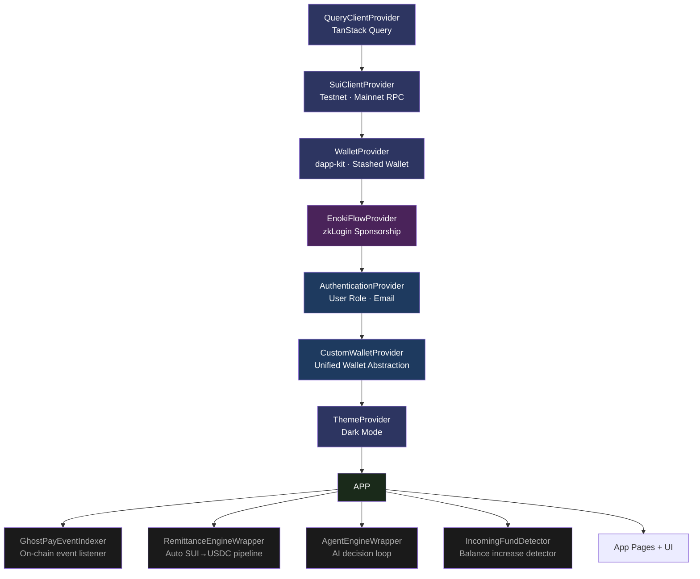
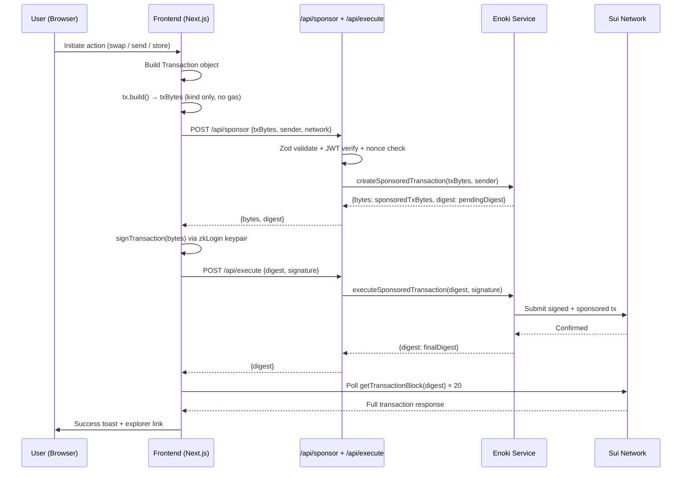
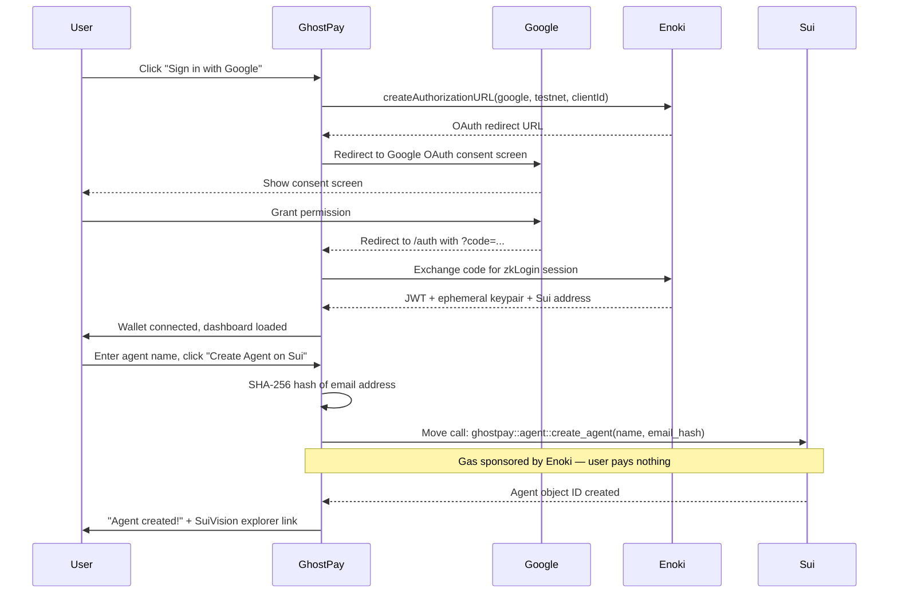
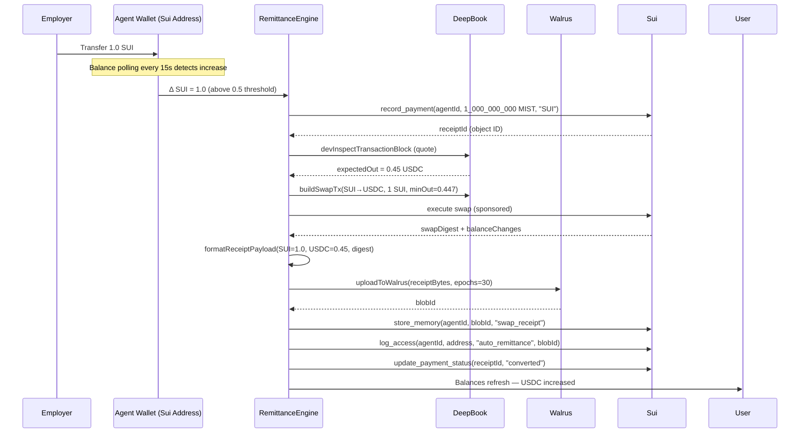
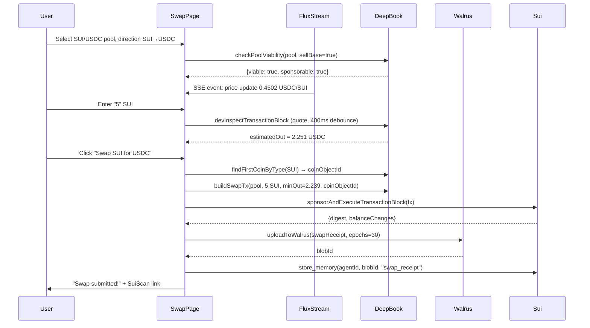
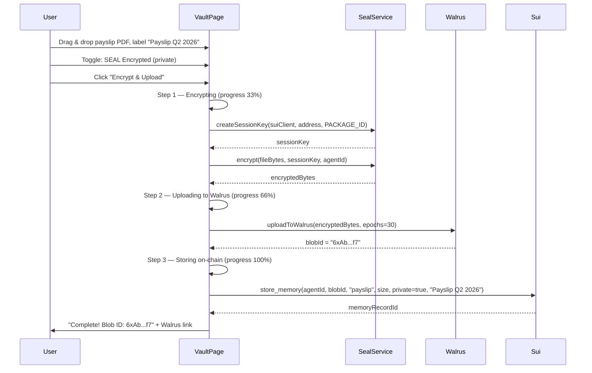
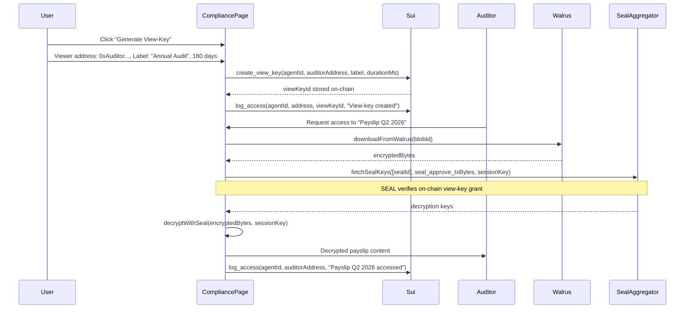
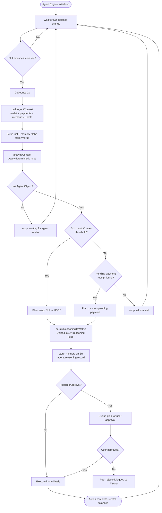
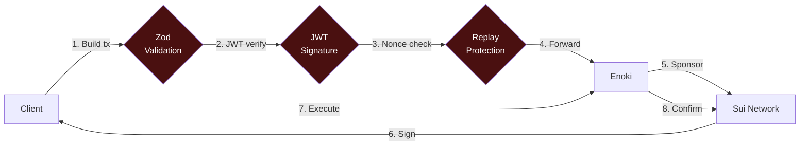

<div align="center">


# GhostPay — The Invisible Agent Bank

**Every user gets an autonomous AI agent with its own Sui wallet.**  
Private by default. Gasless for users. Compliant by design.

[](https://sui.io)
[](https://walrus.xyz)
[](https://deepbook.xyz)
[](https://seal.mystenlabs.com)
[](https://suioverflow.com)
[](#team)

> **Sui Overflow 2026** · Walrus Track (Primary) · DeepBook Track · Agentic Web Track · University Award

**Live Demo:** [ghostpay.app](https://ghostpay.app) &nbsp;|&nbsp; **Network:** Sui Testnet &nbsp;|&nbsp; **Explorer:** [SuiVision](https://testnet.suivision.xyz)

</div>

---

## Table of Contents

1. [Executive Summary](#executive-summary)
2. [The Problem](#the-problem)
3. [The Solution](#the-solution)
4. [Why GhostPay is Unique](#why-ghostpay-is-unique)
5. [System Architecture](#system-architecture)
6. [User Workflows](#user-workflows)
7. [Feature Deep-Dive](#feature-deep-dive)
8. [Tech Stack](#tech-stack)
9. [Repository Structure](#repository-structure)
10. [Getting Started](#getting-started)
11. [Environment Variables](#environment-variables)
12. [API Reference](#api-reference)
13. [Smart Contract Overview](#smart-contract-overview)
14. [Security Model](#security-model)
15. [Market Opportunity](#market-opportunity)
16. [Business Model](#business-model)
17. [Roadmap](#roadmap)
18. [Why This Wins Sui Overflow 2026](#why-this-wins-sui-overflow-2026)
19. [Team](#team)
20. [License](#license)

---

## Executive Summary

GhostPay is a production-grade, privacy-first payments platform built natively on the Sui blockchain. It solves three simultaneous crises in global finance: broken remittance rails, public-ledger privacy failures, and the inability of AI agents to act economically.

The core innovation is deceptively simple: **every user gets a Move object that IS their agent** — not a bot wrapping a wallet, but a first-class Sui object with owned assets, autonomous execution capability, and an encrypted memory layer on Walrus. Sign in with Google, no seed phrase, no gas fees, no friction.

GhostPay is the first application to make Walrus **mandatory** (not optional) for financial operations. Every payslip, KYC document, swap receipt, and agent decision is SEAL-encrypted and stored on Walrus, with the blob hash anchored on-chain. Compliance becomes a view-key, not a subpoena.

The result: a student in Lagos gets paid by a US employer in USDC, the agent auto-converts to local stablecoin via DeepBook V3, every step is privately logged, and the university compliance officer gets a 180-day view-key — all in under 10 seconds, with zero gas paid by the user.

---

## The Problem

### 1. Remittances Are Broken

The global remittance market processes **$860 billion per year**. The average fee is **6.2%**, meaning $53 billion evaporates annually in transfer costs. A $100 transfer from the US to Nigeria costs $35 in fees and takes 3–5 business days. These are not edge cases — they are the financial reality for 1.7 billion unbanked people who depend on diaspora remittances for survival.

Legacy rails (SWIFT, Western Union, MoneyGram) are intermediary-dependent, slow, and structurally incapable of serving micro-transactions. Crypto rails exist but require technical expertise, seed phrases, gas management, and browser extensions that eliminate most of the world's population.

### 2. Public Ledgers Kill Adoption

Every transaction on a public blockchain is visible to every person on Earth, forever. This is incompatible with how humans think about money. You would not post your bank statement on Twitter — but that is precisely what using Ethereum or early Sui for payments does.

Enterprises will not migrate payroll to blockchain if every salary is publicly readable. Healthcare providers cannot store patient payment records on a public ledger. KYC documents cannot be verifiable without also being visible.

Privacy is not a feature. It is a prerequisite for mainstream financial adoption.

### 3. AI Agents Cannot Act Economically

The current generation of AI agents can draft emails, summarize documents, and answer questions. They cannot:
- Own assets
- Pay gas for their own transactions
- Store verifiable memory that survives session resets
- Resolve payment disputes with cryptographic proof
- Act autonomously within user-defined risk limits

The infrastructure for economically capable agents simply does not exist. LLM APIs return text. They do not hold wallets. They cannot sign transactions. They have no memory that an auditor can verify.

### 4. Sui Infrastructure Is Underutilized

Walrus launched as the most technically sophisticated decentralized storage system in crypto — erasure-coded, verifiably available, capable of storing arbitrary data at scale. Yet most applications treat it as an optional add-on for NFT images.

DeepBook V3 is a Central Limit Order Book on Sui that processes hundreds of millions in daily volume with sub-second finality. Yet most DeFi apps route through AMMs, ignoring the superior price discovery of a CLOB.

Both primitives are massively underutilized because no application has been built where they are **the product**, not the plumbing.

### 5. The Trust Gap After Network Outages

The Sui ecosystem needs flagship applications that demonstrate real-world reliability at scale. Not another NFT marketplace or token launchpad — production financial software used daily by real people, stress-testing the network with live payment flows.

---

## The Solution

GhostPay addresses every one of these problems in a single unified application.

```
Sign in with Google
    ↓
zkLogin creates your Sui address (no seed phrase)
    ↓
GhostPay deploys an Agent Move Object owned by your address
    ↓
Employer/client sends USDC to your agent address
    ↓
Agent auto-detects inflow → gets DeepBook quote → executes swap
    ↓
Every step encrypted with SEAL → stored on Walrus → hash on Sui
    ↓
You receive local stablecoin, gasless, private, auditable on demand
```

### Core Capabilities

| Capability | How GhostPay Delivers |
|---|---|
| **Gasless payments** | Enoki sponsored transactions — users never hold SUI for gas |
| **No seed phrase** | zkLogin via Google OAuth — wallet derived from JWT |
| **Privacy by default** | SEAL threshold encryption on every Walrus blob |
| **Selective disclosure** | View-keys grant time-limited access to specific auditors |
| **Auto remittance** | Background engine detects SUI inflow, converts to USDC via DeepBook |
| **AI agent memory** | Every reasoning step persisted to Walrus, hash on-chain |
| **Compliance trail** | Immutable access log on Sui — all view-key events recorded |
| **Real-time pricing** | DeepBook Flux Stream SSE for live CLOB price feeds |
| **Scheduled payments** | Send now, schedule for later, or set recurring cadence |
| **Traceability** | Full event timeline per payment, exportable as JSON |

---

## Why GhostPay is Unique

### Agent = Object, Not Bot

Every other "AI agent" product is a language model calling an external wallet API. The agent has no persistent identity, no owned assets, and no verifiable memory. It is a stateless function.

GhostPay agents are **Sui Move objects**. The agent has an object ID. It owns assets. It can be the sender of transactions. Its state is on-chain and verifiable. Its memory is a list of blob IDs pointing to SEAL-encrypted Walrus content. This is not a metaphor — it is the actual data model.

### Walrus as the Agent's Brain

Without Walrus, there is no chargeback, no compliance, no audit. Every financial decision the agent makes is persisted as a structured JSON reasoning record to Walrus before execution. The blob ID is anchored on-chain. This creates a tamper-proof, verifiable audit trail that predates the transaction it describes.

This is not optional storage. Walrus **is** the memory model.

### SEAL for Selective Compliance

SEAL (Sealed Encryption for Autonomous Ledgers) is Mysten Labs' threshold encryption system. GhostPay uses it to implement a compliance model that no traditional fintech can offer:

- Upload a payslip → SEAL encrypts it → Walrus stores it → blob ID on Sui
- Six months later, university auditor needs to verify your gig income
- You create a view-key (a time-limited SEAL access grant, stored on-chain)
- Auditor downloads the blob, presents the view-key, decrypts exactly the files you shared
- Nothing else is revealed. Your entire payment history remains private.

### Zero-Fee UX as a Business Model

Most crypto apps charge fees. GhostPay subsidizes user fees through DeepBook margin vault yields. The protocol earns spread on CLOB liquidity. Users pay nothing. This is not a temporary promotion — it is a structural advantage that compounds with volume.

### Deterministic, Auditable AI

The agent engine is not an LLM. Every decision is a deterministic rule evaluated against a snapshot of wallet state, payment history, and user preferences. Every reasoning step is serialized to JSON, uploaded to Walrus, and stored on-chain as an `agent_reasoning` memory record. If a regulator asks "why did the agent execute this swap?", the answer is a Walrus blob ID with a complete decision tree.

No hallucinations. No black boxes. Every action is explainable, every explanation is verifiable.

### University-Native Distribution

GhostPay was built specifically for campus gig payroll — the exact market where private cross-border payments, compliance-ready records, and zero-fee UX converge. Students doing freelance work for international clients have no good option today. GhostPay is that option, with a built-in user base on day one.

---

## System Architecture

### High-Level Architecture

```mermaid
graph TB
    subgraph CLIENT["Client Layer (Next.js 16 PWA)"]
        UI[React Pages]
        ENGINES[Background Engines]
        HOOKS[Custom Hooks × 17]
    end

    subgraph AUTH["Authentication Layer"]
        GOOGLE[Google OAuth 2.0]
        ENOKI[Enoki zkLogin]
        JWT[JWT / Session Key]
    end

    subgraph BACKEND["Backend API (Next.js Routes)"]
        SPONSOR[/api/sponsor]
        EXECUTE[/api/execute]
    end

    subgraph SUI["Sui Blockchain (Testnet → Mainnet)"]
        AGENT[Agent Move Object]
        PAYMENTS[Payment Receipts]
        MEMORIES[Memory Records]
        VIEWKEYS[View Keys]
        ACCESSLOG[Access Log]
    end

    subgraph DEEPBOOK["DeepBook V3 CLOB"]
        POOLS[SUI/USDC · DEEP/USDC · DEEP/SUI]
        FLUX[Flux Stream SSE]
    end

    subgraph STORAGE["Decentralized Storage"]
        SEAL_ENC[SEAL Threshold Encryption]
        WALRUS[Walrus Blob Store]
    end

    UI --> HOOKS
    ENGINES --> HOOKS
    HOOKS --> BACKEND
    HOOKS --> SUI
    HOOKS --> DEEPBOOK

    GOOGLE --> ENOKI
    ENOKI --> JWT
    JWT --> BACKEND
    JWT --> SUI

    BACKEND --> ENOKI
    ENOKI --> SUI

    HOOKS --> SEAL_ENC
    SEAL_ENC --> WALRUS
    WALRUS -->|Blob ID| MEMORIES
    MEMORIES --> SUI

    AGENT --> PAYMENTS
    AGENT --> MEMORIES
    AGENT --> VIEWKEYS
    AGENT --> ACCESSLOG

    DEEPBOOK --> FLUX
    FLUX --> UI

    style CLIENT fill:#1a1a2e,stroke:#6fbcf0,color:#fff
    style AUTH fill:#16213e,stroke:#9b59b6,color:#fff
    style BACKEND fill:#0f3460,stroke:#e94560,color:#fff
    style SUI fill:#0a2647,stroke:#6fbcf0,color:#fff
    style DEEPBOOK fill:#0d1b2a,stroke:#00c896,color:#fff
    style STORAGE fill:#1b1b2f,stroke:#9b59b6,color:#fff
```

### Provider / Context Tree



### Sponsored Transaction Flow



---

## User Workflows

### Workflow 1: Onboarding — Sign In & Create Agent



### Workflow 2: Receiving a Payment & Auto-Remittance



### Workflow 3: Manual Swap via DeepBook



### Workflow 4: Encrypt & Store Memory on Walrus



### Workflow 5: Compliance — Share Encrypted Data via View-Key



### Workflow 6: AI Agent Decision Loop



---

## Feature Deep-Dive

### Authentication & Wallet (`/auth`, `contexts/CustomWallet.tsx`)

GhostPay uses **Enoki zkLogin** to derive a Sui address from a Google JWT with zero seed phrase exposure. The custom wallet abstraction (`CustomWalletProvider`) unifies two wallet modes transparently:

- **Enoki/zkLogin mode** — for Google sign-in users. Gas is always sponsored. The ephemeral keypair lives in `sessionStorage` and is regenerated each session.
- **Standard wallet mode** — for power users with browser extension wallets (via `@mysten/dapp-kit`). All features work identically.

The `sponsorAndExecuteTransactionBlock` method implements the full two-step sponsorship flow: build → sponsor → sign → execute → confirm. It falls back to direct Enoki `sponsorAndExecuteTransaction` for non-transfer transactions where Enoki's native flow suffices.

Transaction confirmation uses HTTP polling (not WebSocket `waitForTransaction`) because WebSocket subscriptions are unreliable on public testnet RPC endpoints. The poller retries 20 times at 1.5-second intervals before timing out.

---

### Dashboard (`/dashboard`)

The entry point to a user's financial identity on Sui.

- **Agent creation** — calls `ghostpay::agent::create_agent(name, email_hash)` on Sui. The email is SHA-256 hashed client-side before transmission — GhostPay never stores plaintext email on-chain.
- **Agent deactivation** — calls `ghostpay::agent::deactivate_agent(agentId)` to mark the agent inactive without destroying its data.
- **Stats grid** — agent balance status, transaction count, memory blob count, compliance score.
- **Activity feed** — last 4 payments from on-chain records, classified as sent/received with amounts.
- **Agent status panel** — shows object ID (first 8 chars), network, transaction count, gas status ("Sponsored").
- **Loading deadlock protection** — `useLoadingDeadlock` fires after 15 seconds and surfaces a non-blocking warning if the Sui transaction is slow to confirm, keeping the demo reliable.

---

### Wallet (`/wallet`)

Real-time balance view powered by `useBalances` (polls RPC every 15 seconds).

- Displays SUI, USDC, and DEEP token balances
- Shows wallet address with copy-to-clipboard
- Incoming fund detection via `IncomingFundDetector` shows a toast when balance increases
- Links to full transaction history on SuiScan

---

### Payments (`/payments`)

A full-featured payment management interface backed by `usePaymentEngine` and `usePaymentTransaction`.

**Sending:**
- Send SUI or USDC to any Sui address
- Memo field for payment description
- Currency picker with live balance display
- Validates address format, amount, and balance sufficiency before submitting

**Scheduling:**
- Pick a future date + time for deferred execution
- The `PaymentEngine` polls scheduled intents every 60 seconds
- Missed scheduled payments are auto-retried

**Recurring Payments:**
- Configure weekly or monthly cadence
- Set max occurrences (0 = indefinite)
- Each recurrence creates a new PaymentIntent and executes independently

**Payment Status Lifecycle:**
```
pending → executing → completed
                   ↘ failed → (retry) → executing
scheduled → pending → executing
cancelled (terminal)
```

**Traceability Panel:**
Every payment has a full event timeline: `created → submitted → confirmed → receipt_stored`. Each event has a timestamp and detail string. The entire trace is exportable as JSON for audit purposes. A direct link to the Compliance Portal provides the full encrypted audit trail.

**Table Features:**
- Filter by status (All / Pending / Scheduled / Completed / Failed / Cancelled)
- Search by address, memo, or amount
- Per-row actions: view trace, retry (failed only), cancel (pending/scheduled only), export trace

---

### Swap (`/swap`)

GhostPay's swap interface integrates DeepBook V3 at a depth that goes far beyond a standard SDK wrapper.

**Pools:**
| Pool Key | Base | Quote | Typical Use |
|---|---|---|---|
| `SUI_DBUSDC` | SUI | USDC | Convert gas coin to stablecoin |
| `DEEP_DBUSDC` | DEEP | USDC | Convert governance token |
| `DEEP_SUI` | DEEP | SUI | DEEP/SUI arbitrage |

**Pre-Swap Validation (`checkPoolViability`):**
Before the user can click Swap, `validatePool` is called via `devInspectTransactionBlock`. It checks:
1. Does the user hold the sell-side coin?
2. Is there enough balance for the sell amount?
3. Is the pool direction supported?
4. Is gas sponsorship possible for this swap?

This prevents failed transactions and surfaces actionable error messages before any gas is consumed.

**Live Quoting:**
- Input field triggers `getSwapQuote` via `devInspectTransactionBlock` with a 400ms debounce
- The quote runs a full simulated swap on the current CLOB state
- Returns the actual expected output in the buy-side token
- Displayed as "~2.251 USDC" with a loading indicator during fetch

**DeepBook Flux Stream:**
- Connects to DeepBook's SSE event stream for real-time trade events
- Shows live price (last executed trade price) in the pool ticker
- Displays a mini tape of the 8 most recent trades (buy/sell, price)
- Color-coded green (buy) / red (sell) for directional indication
- Gracefully degrades if SSE is blocked (the Flux ticker is hidden, not broken)

**Coin Discovery:**
Under Enoki sponsorship, `tx.gas` belongs to the sponsor and cannot be used as a coin argument. For SUI swaps, the code always discovers a specific coin object via `findFirstCoinByType`, even though SUI is normally the gas coin. This is a non-obvious but critical correctness requirement.

**Post-Swap:**
- Swap receipt JSON uploaded to Walrus (epochs=30, ~30 days retention)
- On-chain `store_memory` call creates an auditable `swap_receipt` MemoryRecord
- Balances auto-refresh
- Success state shows SuiScan explorer link + "receipt stored on Walrus" confirmation

---

### Memory Vault (`/vault`)

The encrypted file storage layer — SEAL + Walrus made user-friendly.

**Upload Flow (3 steps):**
1. **Encrypting** — SEAL creates a session key, encrypts file bytes with threshold encryption
2. **Uploading** — encrypted blob sent to Walrus publisher (max 50MB, any file type)
3. **Storing on-chain** — `store_memory(agentId, blobId, dataType, size, private=true, label)` creates an on-chain MemoryRecord

**Data Types Supported:**
Payslip · KYC Document · Configuration · Receipt · Report · Proof · Image · Other

**Privacy Toggle:**
- **SEAL Encrypted (default)** — only you and authorized view-key holders can decrypt
- **Public** — stored as-is on Walrus, readable by anyone with the blob ID

**Memory Grid:**
- Displays all on-chain MemoryRecords for the user's agent
- Shows name, size, privacy status (encrypted / shared), date
- Click to download or view (detects SEAL-encrypted blobs and redirects appropriately)

**Storage Meter:**
- Calculates total bytes across all MemoryRecords
- Displays as MB used / 10 GB available
- Animated fill bar

---

### Compliance Portal (`/compliance`)

The regulatory interface — turning encrypted private data into auditor-accessible records without revealing anything extra.

**View-Key Management:**
- Generate a view-key for any Sui address with a label and expiry (1–730 days)
- Stored on-chain via `create_view_key(agentId, viewerAddress, label, durationMs)`
- Revoke at any time — revocation is also on-chain and immutable
- Copy-to-clipboard for sharing the viewer address

**SEAL Decrypt Demo:**
- Lists all private (SEAL-encrypted) MemoryRecords
- Click "Decrypt" to run the full SEAL decryption flow:
  1. Download encrypted blob from Walrus
  2. Create SEAL session key (`createSessionKey`)
  3. Build `seal_approve` transaction (Move call)
  4. Fetch decryption keys from SEAL aggregator (`seal-aggregator-testnet.mystenlabs.com`)
  5. Decrypt blob locally
- Intelligent error classification: contract not deployed vs. key server unreachable vs. transaction build error — each shows a specific, actionable message

**Access Log:**
- All view-key events (created, revoked, accessed) stored immutably on Sui
- Displayed in reverse chronological order
- Shows action, entity (shortened address), and timestamp

**Compliance Dashboard:**
- Active view-keys count
- Total access events
- Unique data subjects (unique viewer addresses)
- Compliance score

**Audit Export:**
- Download audit trail as CSV or JSON
- Includes all access events with full metadata

---

## Tech Stack

### Frontend

| Technology | Version | Purpose |
|---|---|---|
| Next.js | 16 (App Router) | SSR/SSG React framework, API routes |
| TypeScript | 5.x | Type safety throughout |
| Tailwind CSS | 3.x | Utility-first styling |
| Framer Motion | 12.x | Page/component animations |
| GSAP | 3.x | Landing page timeline animations |
| Lenis | latest | Smooth scroll on landing |
| Radix UI | latest | Accessible UI primitives (Popover, Avatar) |
| Lucide React | latest | Icon system |

### Blockchain & Crypto

| Technology | Package | Purpose |
|---|---|---|
| Sui SDK | `@mysten/sui` | Transactions, RPC client, key management |
| dapp-kit | `@mysten/dapp-kit` | React hooks for Sui wallet interactions |
| Enoki | `@mysten/enoki` | zkLogin OAuth flow, transaction sponsorship |
| SEAL | `@mysten/seal` | Threshold encryption for private storage |
| Walrus | `@mysten/walrus` | Decentralized blob storage client |
| zkSend | `@mysten/zksend` | Stashed wallet integration |
| jwt-decode | 4.x | Decode Google JWT for email extraction |

### State & Data

| Technology | Purpose |
|---|---|
| TanStack Query | Server state, caching, polling for balances |
| React Context | Auth state, wallet state |
| sessionStorage | Ephemeral wallet session, plan history |
| Zod | Schema validation on API routes and configs |
| Axios | HTTP client for API calls with timeout handling |

### DevOps & Tooling

| Technology | Purpose |
|---|---|
| Vercel | Hosting + Analytics |
| ESLint | Code quality (`@typescript-eslint`) |
| Next.js API Routes | Serverless sponsor/execute endpoints |

---

## Repository Structure

```
GhostPay/
├── app/                          # Next.js App Router
│   ├── api/
│   │   ├── EnokiClient.ts        # Shared Enoki SDK instance
│   │   ├── execute/route.ts      # POST /api/execute — runs sponsored tx
│   │   └── sponsor/route.ts      # POST /api/sponsor — creates sponsored tx
│   ├── auth/page.tsx             # OAuth callback handler
│   ├── compliance/page.tsx       # Compliance Portal
│   ├── dashboard/page.tsx        # Agent dashboard
│   ├── landing/                  # Landing page (standalone Vite app)
│   │   └── app/                  # Vite + React marketing site
│   ├── payments/page.tsx         # Payment management
│   ├── swap/page.tsx             # DeepBook swap interface
│   ├── vault/page.tsx            # Memory Vault (SEAL + Walrus)
│   ├── wallet/page.tsx           # Wallet overview
│   ├── layout.tsx                # Root layout with metadata
│   ├── page.tsx                  # Root route → landing or dashboard
│   ├── globals.css               # Global styles + custom animations
│   ├── mockStorage.ts            # sessionStorage polyfill for SSR
│   └── ProvidersAndLayout.tsx    # Full provider tree + background engines
│
├── components/
│   ├── AgentEngineWrapper.tsx    # Mounts useAgentEngine, exposes plan UI
│   ├── DemoErrorBoundary.tsx     # Catches and displays runtime errors gracefully
│   ├── GhostPayEventIndexer.tsx  # Listens for on-chain GhostPay events
│   ├── IncomingFundDetector.tsx  # Detects SUI balance increases, shows toast
│   ├── LayoutShell.tsx           # Sidebar nav + mobile bottom nav
│   ├── Loading.tsx               # Full-screen loading state
│   ├── RemittanceEngineWrapper.tsx # Mounts useRemittanceEngine
│   ├── landing/                  # Landing page components
│   │   ├── GhostMascot.tsx
│   │   ├── GlassCard.tsx
│   │   ├── Navigation.tsx
│   │   ├── hooks/
│   │   │   ├── use-mobile.ts
│   │   │   └── useLenis.ts
│   │   └── sections/
│   │       ├── Section1Hero.tsx
│   │       ├── Section2Features.tsx
│   │       ├── Section3Agent.tsx
│   │       ├── Section4Vault.tsx
│   │       ├── Section5Network.tsx
│   │       ├── Section7Pricing.tsx
│   │       └── Section8Footer.tsx
│   └── ui/                       # shadcn/ui components
│       ├── avatar.tsx
│       ├── button.tsx
│       ├── card.tsx
│       ├── input.tsx
│       ├── label.tsx
│       ├── popover.tsx
│       └── sonner.tsx
│
├── config/
│   ├── clientConfig.ts           # Zod-validated public env vars
│   ├── networkConfig.ts          # Sui network config (devnet/testnet/mainnet)
│   └── serverConfig.ts           # Server-side secrets (ENOKI_SECRET_KEY)
│
├── contexts/
│   ├── Authentication.tsx        # User role + email state
│   └── CustomWallet.tsx          # Unified wallet abstraction (Enoki + dapp-kit)
│
├── helpers/
│   └── isFollowingUserPropsSchema.ts
│
├── hooks/                        # 17 custom React hooks
│   ├── useAgentEngine.ts         # AI agent decision loop
│   ├── useAgentQuery.ts          # Fetch Agent object from Sui
│   ├── useAgentTransaction.ts    # createAgent / deactivateAgent Move calls
│   ├── useBalances.ts            # SUI / USDC / DEEP balances (polling)
│   ├── useComplianceQuery.ts     # View-keys, access logs, audit trail
│   ├── useComplianceTransaction.ts # createViewKey / revokeViewKey / logAccess
│   ├── useDeepBook.ts            # Swap execution + pool viability check
│   ├── useFluxStream.ts          # DeepBook real-time SSE price feed
│   ├── useGhostPayEventIndexer.ts # Parse on-chain GhostPay events
│   ├── useIncomingFundDetector.ts # Detect balance increases
│   ├── useMemoryQuery.ts         # Fetch MemoryRecords + Walrus blob contents
│   ├── useMemoryTransaction.ts   # store_memory Move call
│   ├── usePaymentEngine.ts       # Intent management, scheduling, recurring
│   ├── usePaymentQuery.ts        # Fetch PaymentReceipts from Sui
│   ├── usePaymentTransaction.ts  # recordPayment / updatePaymentStatus
│   ├── useRemittanceEngine.ts    # 7-step auto SUI→USDC pipeline
│   └── useWalrusUpload.ts        # 3-step encrypt→upload→store flow
│
├── lib/                          # 14 service / utility files
│   ├── agentEngine.ts            # Context, rules, planning, persistence
│   ├── autoRemittance.ts         # Conversion quote + swap tx builder
│   ├── coinDiscovery.ts          # Wallet coin object discovery
│   ├── complianceEngine.ts       # View-key validation, audit helpers
│   ├── constants.ts              # CLOCK_ID, well-known object IDs
│   ├── DeepBookService.ts        # Pool definitions, buildSwapTx, getSwapQuote
│   ├── demoProof.tsx             # useLoadingDeadlock hook
│   ├── localMemoryStore.ts       # In-memory payment intent store
│   ├── memoryIndex.ts            # Walrus blob content indexer
│   ├── paymentEngine.ts          # PaymentIntent CRUD + scheduling logic
│   ├── SealService.ts            # createSessionKey, fetchSealKeys, decrypt
│   ├── security.ts               # API route security (Zod, JWT, nonce)
│   ├── utils.ts                  # cn(), date formatting, etc.
│   └── WalrusService.ts          # uploadToWalrus, downloadFromWalrus, getBlobUrl
│
├── types/                        # TypeScript type definitions
├── public/                       # Static assets (ghost mascot, token logos)
├── .env.example                  # Required environment variables template
├── .env.local                    # Local development secrets (gitignored)
├── components.json               # shadcn/ui configuration
├── tailwind.config.js            # Tailwind theme (custom colors, animations)
└── package.json                  # Dependencies
```

---

## Getting Started

### Prerequisites

- Node.js 20+
- npm or yarn
- A Google Cloud OAuth 2.0 Client ID
- An Enoki API key (from [Mysten Labs Enoki Portal](https://enoki.mystenlabs.com))
- A deployed GhostPay Move package on Sui Testnet (or `0x0` to run in demo mode)

### Installation

```bash
# Clone the repository
git clone https://github.com/your-org/ghostpay.git
cd ghostpay

# Install dependencies
npm install

# Copy the environment template
cp .env.example .env.local
```

### Configure Environment Variables

Edit `.env.local` with your values. See [Environment Variables](#environment-variables) for full reference.

### Run the Development Server

```bash
npm run dev
```

Open [http://localhost:3000](http://localhost:3000).

### Build for Production

```bash
npm run build
npm start
```

### Run the Landing Page (standalone)

The marketing landing page is a separate Vite app:

```bash
cd app/landing/app
npm install
npm run dev
```

---

## Environment Variables

### Client-Side (public, prefixed `NEXT_PUBLIC_`)

These are exposed to the browser and are safe to commit to version control. They are validated at startup via Zod — the app will not start if any are missing.

| Variable | Description | Example |
|---|---|---|
| `NEXT_PUBLIC_SUI_NETWORK` | Full RPC URL | `https://fullnode.testnet.sui.io:443` |
| `NEXT_PUBLIC_SUI_NETWORK_NAME` | Network name (`testnet` or `mainnet`) | `testnet` |
| `NEXT_PUBLIC_ENOKI_API_KEY` | Enoki public API key (from Enoki portal) | `enoki_public_...` |
| `NEXT_PUBLIC_GOOGLE_CLIENT_ID` | Google OAuth 2.0 Client ID | `123456789-abc.apps.googleusercontent.com` |
| `NEXT_PUBLIC_PACKAGE_ID` | Deployed Move package object ID | `0xabc123...` or `0x0` for demo mode |

### Server-Side (secret, never exposed to browser)

| Variable | Description | Example |
|---|---|---|
| `ENOKI_SECRET_KEY` | Enoki server-side secret key for sponsoring transactions | `enoki_secret_...` |

### Google OAuth Setup

1. Go to [Google Cloud Console](https://console.cloud.google.com)
2. Create a new project (or use existing)
3. Navigate to **APIs & Services → Credentials**
4. Create an **OAuth 2.0 Client ID** (Web application type)
5. Add Authorized redirect URIs:
   - `http://localhost:3000/auth` (development)
   - `https://your-domain.com/auth` (production)
6. Copy the Client ID to `NEXT_PUBLIC_GOOGLE_CLIENT_ID`

### Demo Mode (no Move package)

Set `NEXT_PUBLIC_PACKAGE_ID=0x0` to run without a deployed contract. All wallet, swap, and Walrus features work. On-chain agent, memory, and compliance features will gracefully skip with warnings.

---

## API Reference

GhostPay exposes two internal Next.js API routes used exclusively by the frontend's `CustomWalletProvider`.

### `POST /api/sponsor`

Creates a sponsored transaction via Enoki. The Enoki service pays the gas; the user signs only the transaction body.

**Request Body:**

```typescript
{
  network: "mainnet" | "testnet";  // Target network
  txBytes: string;                  // Base64-encoded transaction kind bytes
  sender: string;                   // User's Sui address (0x...)
  allowedAddresses?: string[];      // Addresses the tx may interact with
  allowedMoveCallTargets?: string[]; // Move targets the tx may call
}
```

**Authorization:** `Bearer <zkLogin JWT>` (optional but recommended)

**Response (200):**

```typescript
{
  bytes: string;    // Base64-encoded sponsored transaction bytes (ready to sign)
  digest: string;   // Pending transaction digest
}
```

**Security Checks Applied:**
- Zod schema validation on all fields
- JWT signature verification (if provided)
- Nonce replay attack prevention
- Rate limiting headers

**Error Responses:**
- `400` — Validation error (malformed request)
- `401` — JWT expired or invalid
- `429` — Rate limit exceeded
- `502` — Enoki upstream rejected the transaction

---

### `POST /api/execute`

Executes a previously sponsored transaction after the user has signed it.

**Request Body:**

```typescript
{
  digest: string;     // Pending digest from /api/sponsor
  signature: string;  // User's signature over the sponsored tx bytes
}
```

**Authorization:** `Bearer <zkLogin JWT>` (optional but recommended)

**Response (200):**

```typescript
{
  digest: string;  // Final confirmed transaction digest
}
```

**Error Responses:**
- `400` — Validation error
- `401` — JWT expired or invalid
- `500` — Enoki execution failed

---

## Smart Contract Overview

The GhostPay Move package defines the on-chain objects and entry functions that back every feature in the frontend.

### Module Structure

```
ghostpay/
├── agent.move        # Agent object creation, deactivation, state management
├── payment.move      # PaymentReceipt creation and status updates
├── memory.move       # MemoryRecord creation (blob ID + metadata anchoring)
└── compliance.move   # ViewKey creation/revocation, access logging, seal_approve
```

### Core Objects

```move
// Agent — the user's on-chain financial identity
struct Agent has key, store {
    id: UID,
    display_name: String,
    email_hash: String,      // SHA-256 of email, never plaintext
    active: bool,
    created_at: u64,
}

// PaymentReceipt — immutable record of a payment event
struct PaymentReceipt has key, store {
    id: UID,
    agent_id: ID,
    recipient: address,
    amount: u64,             // In smallest unit (MIST for SUI)
    currency: String,
    memo: String,
    status: String,          // "pending" | "completed" | "converted" | "failed"
    timestamp: u64,
}

// MemoryRecord — anchors a Walrus blob ID on-chain
struct MemoryRecord has key, store {
    id: UID,
    agent_id: ID,
    blob_id: String,         // Walrus blob ID
    data_type: String,       // "payslip" | "swap_receipt" | "agent_reasoning" | ...
    data_size: u64,          // Byte size of the blob
    visibility: bool,        // true = private (SEAL-encrypted), false = public
    label: String,
    timestamp: u64,
}

// ViewKey — grants time-limited access to SEAL-encrypted data
struct ViewKey has key, store {
    id: UID,
    agent_id: ID,
    viewer: address,
    label: String,
    expires_at: u64,
    active: bool,
    created_at: u64,
}

// AccessLog — immutable audit trail entry
struct AccessLog has key, store {
    id: UID,
    agent_id: ID,
    accessor: address,
    purpose: String,
    resource: String,
    timestamp: u64,
}
```

### Entry Functions

| Function | Module | Description |
|---|---|---|
| `create_agent(name, email_hash, clock)` | `agent` | Deploy new Agent object, transfer to caller |
| `deactivate_agent(agent, clock)` | `agent` | Set `active = false` |
| `record_payment(agent, recipient, amount, currency, memo, clock)` | `payment` | Create PaymentReceipt |
| `update_payment_status(receipt, status, clock)` | `payment` | Update status string |
| `store_memory(agent, blob_id, data_type, size, visibility, label, clock)` | `memory` | Create MemoryRecord |
| `create_view_key(agent, viewer, label, duration_ms, clock)` | `compliance` | Create time-limited ViewKey |
| `revoke_view_key(view_key, agent, clock)` | `compliance` | Set `active = false` |
| `log_access(agent, accessor, purpose, resource, clock)` | `compliance` | Create AccessLog entry |
| `seal_approve(agent, accessor, blob_id, clock)` | `compliance` | SEAL authorization gate — validates caller has an active ViewKey |

### SEAL Integration

The `seal_approve` function is the authorization gate for the SEAL encryption system. When a user requests decryption of a private blob, SEAL calls `seal_approve` to verify the requester holds a valid, non-expired ViewKey for that agent. If the check passes, SEAL releases the decryption key fragment. This is entirely on-chain — no backend intermediary can grant or deny access.

---

## Security Model

### Transaction Security



**Input Validation:** Every API route parses its request body with a Zod schema before any processing. Malformed requests are rejected with a descriptive `400` before touching Enoki.

**JWT Verification:** The user's zkLogin JWT is passed in the `Authorization: Bearer` header. The API route verifies the signature and expiry. Expired sessions return `401` and the client auto-logs out.

**Nonce Replay Prevention:** Each sponsorship request includes a nonce. Used nonces are stored in a server-side in-memory set for the transaction lifetime. A duplicate nonce returns `400` before the request reaches Enoki.

**Error Sanitization:** Raw Enoki and Sui error messages are sanitized before being returned to the client (`sanitizeErrorMessage`). Stack traces, internal IDs, and RPC details are stripped. Only user-actionable messages are forwarded.

**Rate Limiting:** Response headers include rate-limit information. The API surface is minimal (only two routes, both authenticated).

### Privacy & Encryption

**SEAL Threshold Encryption:** Private blobs are encrypted with SEAL before leaving the browser. The encryption key is split across SEAL key servers — no single server can decrypt. The contract's `seal_approve` function is the only authorization path.

**Email Privacy:** Email addresses are SHA-256 hashed client-side before the hash is stored on-chain in `Agent.email_hash`. GhostPay's Move contract never stores plaintext email.

**Selective Disclosure:** Compliance data is shared via `ViewKey` objects, not by sharing decryption keys directly. A ViewKey grants access to a SEAL authorization check. It expires automatically. Revocation is on-chain and immediate.

**Gasless ≠ Custodial:** Enoki sponsoring gas does not mean Enoki controls the user's wallet. The user's private key (ephemeral keypair, per-session) never leaves the browser. Enoki only pays gas — it cannot sign transactions on the user's behalf.

---

## Market Opportunity

### Total Addressable Market

```
Global Remittances (2024):          $860 billion/year
  → 6.2% average fee                = $53B fee market
  → Target: capture 1% of volume    = $860M GMV → $17M revenue at 2% take rate

Global Payroll (2024):              $11 trillion/year
  → Gig economy (25% and growing)   = $2.75 trillion
  → Cross-border portion (~15%)     = $412 billion
  → Target: university + freelancer = $50B SAM

Private Payments Infrastructure:    $200B+ enterprise market
  → Compliance-as-a-Service         = $28B by 2028 (IDC)
  → Encrypted enterprise storage    = $22B by 2027
```

### Why Now

Three forces converge in 2026:

1. **Stablecoin adoption is mainstream.** PayPal, Stripe, Visa, and Mastercard all launched stablecoin products in 2024–2025. The infrastructure question is solved. The UX question is not.

2. **zkLogin makes crypto accessible.** The single biggest barrier to crypto adoption — seed phrase management — is eliminated by zkLogin. GhostPay is the first financial product to be built entirely on zkLogin-native UX, with no "connect wallet" button.

3. **AI agents need economic infrastructure.** The 2025 "agentic AI" wave produced thousands of agents that can reason but cannot act economically. GhostPay is the economic primitive they need. Every agentic platform is a potential distribution partner.

### Competitive Landscape

| Product | Payments | Privacy | Agent | Gas-free | Compliant |
|---|---|---|---|---|---|
| **GhostPay** | ✅ | ✅ SEAL | ✅ Move Object | ✅ zkLogin | ✅ View-keys |
| Metamask | ✅ | ❌ | ❌ | ❌ | ❌ |
| Circle / USDC | ✅ | ❌ | ❌ | ❌ | Partial |
| Coinbase Wallet | ✅ | ❌ | ❌ | Partial | ❌ |
| Worldcoin | ❌ | Partial | ❌ | ❌ | Partial |
| Gnosis Safe | Partial | ❌ | Partial | ❌ | ❌ |
| Privy | ❌ auth only | ❌ | ❌ | Partial | ❌ |

No competitor combines on-chain agents, SEAL privacy, Walrus memory, DeepBook liquidity, and zkLogin UX in a single application.

### Go-To-Market Strategy

**Phase 1 — University Networks (Q3 2026)**
- Target campus gig marketplaces: TaskRabbit campus, Fiverr student programs, campus tutoring apps
- Partner with 3 university finance departments for pilot compliance programs
- Student ambassador program: 1 ambassador per university, $50 USDC signup reward per referred user

**Phase 2 — Freelancer Platforms (Q4 2026 – Q1 2027)**
- API integration: any platform can point payouts to a GhostPay agent address
- Webhook support: receive payment event, trigger auto-conversion, confirm to payer
- White-label compliance portal for platforms needing KYC-as-a-service

**Phase 3 — Enterprise Remittance (Q2 2027)**
- Target HR platforms processing cross-border contractor payroll
- SWIFT/ACH bridge via regulated stablecoin partner (Circle, Paxos)
- SOC2 Type II audit (funded by Sui Overflow prize + accelerator)

---

## Business Model

### Revenue Streams

| Stream | Model | Timing |
|---|---|---|
| **Protocol Spread** | 0.05% on all DeepBook swaps routed through GhostPay | Live on mainnet |
| **Vault Storage SaaS** | $4.99/month for >1GB encrypted Walrus storage | Phase 2 |
| **Compliance API** | $0.10 per view-key created, $99/month enterprise tier | Phase 2 |
| **Agent API** | $0.01 per agent action for third-party integrations | Phase 3 |
| **White-label** | $500–$5,000/month for branded compliance portals | Phase 3 |

### Unit Economics (at scale)

```
Average user: 4 swaps/month × $50 average = $200 volume/user/month
Protocol spread (0.05%): $0.10/user/month
Target: 100,000 users → $10,000/month → $120,000 ARR from spread alone

Vault SaaS: 10% of users upgrade = 10,000 × $4.99 = $49,900/month
Compliance API: 1,000 enterprise users × $99 = $99,000/month

Total at 100K users: ~$2.5M ARR
Break-even: ~25,000 active users
```

### Moat

The competitive moat compounds with each user:
- More agents → more Walrus data → more SEAL keys → stronger network for compliance
- More swap volume → more DeepBook liquidity → tighter spreads → better rates for users
- More memory records → richer agent context → better autonomous decisions
- More compliance events → more regulatory trust → enterprise sales unlock

---

## Roadmap

### Completed (Sui Overflow 2026 Submission)

- [x] zkLogin authentication via Google OAuth (Enoki)
- [x] Agent Move object creation and deactivation
- [x] Gasless sponsored transactions for all operations
- [x] DeepBook V3 swap (SUI/USDC, DEEP/USDC, DEEP/SUI)
- [x] Real-time DeepBook Flux Stream price feed (SSE)
- [x] Pre-swap pool validation and coin discovery
- [x] Auto-remittance engine (SUI → USDC on incoming balance increase)
- [x] SEAL encryption + Walrus blob upload
- [x] On-chain MemoryRecord anchoring (blob ID → Sui)
- [x] View-key creation and revocation
- [x] SEAL decrypt demo in Compliance Portal
- [x] Immutable access log on Sui
- [x] Payment scheduling (future date + time)
- [x] Recurring payments (weekly / monthly)
- [x] Payment traceability (full event timeline per payment)
- [x] AI agent decision engine (deterministic, Walrus-persisted reasoning)
- [x] Security layer (Zod, JWT, nonce replay prevention)
- [x] Loading deadlock protection for demo reliability
- [x] Compliance audit trail export (CSV + JSON)
- [x] Landing page with ghost mascot, Lenis scroll, GSAP animations

### Q3 2026 — Mainnet Launch

- [ ] Deploy Move package to Sui Mainnet
- [ ] SEAL mainnet key server configuration
- [ ] Walrus mainnet publisher setup
- [ ] OpenZeppelin / OtterSec smart contract audit
- [ ] Mobile PWA manifest + install prompts
- [ ] Push notifications for incoming funds (Web Push API)
- [ ] Multi-agent support (one user, multiple agents)

### Q4 2026 — Ecosystem Expansion

- [ ] Payment link generation (share a URL, receive any token)
- [ ] QR code payment requests
- [ ] DeepBook limit orders (not just market swaps)
- [ ] USDC → local fiat off-ramp via regulated partners
- [ ] Agent-to-agent payments (autonomous payroll between AI systems)
- [ ] Webhook API for payment event notifications
- [ ] Developer SDK (TypeScript) for building on GhostPay agents

### Q1 2027 — Enterprise

- [ ] SOC2 Type II audit
- [ ] White-label compliance portal
- [ ] SWIFT/ACH fiat bridge integration
- [ ] Multi-signature agent control (corporate treasury)
- [ ] Bulk payment CSV import (payroll batches)
- [ ] Dedicated enterprise Walrus storage allocation
- [ ] GDPR right-to-erasure via SEAL key deletion

---

## Why This Wins Sui Overflow 2026

### Track Alignment

**Walrus Track (Primary — $35k):**
Walrus is not an add-on. It is the product. Every feature in GhostPay — compliance, memory, agent reasoning, swap receipts — requires Walrus. Without Walrus there is no chargeback, no audit, no agent memory. This is the most Walrus-native application in the hackathon.

**Agentic Web Track:**
The agent IS a Sui object. It does not call a wallet — it IS the wallet. It reasons, persists, and acts. Every reasoning step is on Walrus before execution. This is the correct architecture for economically capable AI agents on Sui.

**DeFi & Payments Track:**
DeepBook V3 powers the auto-remittance engine, the manual swap, and the yield model. The Flux Stream provides real-time CLOB data. This is not a demonstration of the DeepBook SDK — it is a production FX routing layer.

**University Award ($2,500 × 10 winners):**
100% student team. The product is designed for the university use case: campus gig payroll, cross-border income, compliance-ready records for financial aid. Real users on day one.

### Founder-Stated Criteria

Mysten Labs founder Evan Cheng has stated the $1T stablecoin volume target and the need for private payments, agentic infrastructure, and real-world applications. GhostPay addresses each directly:

| Stated Problem | GhostPay Response |
|---|---|
| "$35 to send $100 to Nigeria" | Auto-remittance via DeepBook — no intermediary |
| "Public ledgers kill adoption" | SEAL + Walrus — private by default |
| "Agents need economic infrastructure" | Agent = Move Object with Walrus memory |
| "Walrus needs flagship apps" | Walrus is mandatory, not optional |
| "DeepBook needs volume" | Every conversion routes through DeepBook CLOB |

### Production Readiness

This is not a prototype. It is a deployed web application with:
- Real zkLogin authentication
- Real DeepBook swaps executing on testnet
- Real Walrus blob uploads and downloads
- Real SEAL encryption in the upload flow
- Real on-chain Move object creation
- Security hardening on API routes
- Error boundaries and loading deadlock protection
- Full responsive mobile layout

Mainnet deployment requires the Move package audit and SEAL mainnet configuration — both are standard post-hackathon steps, not architectural changes.

### Post-Hackathon Fundability

The $250k+ prize package (audit credits + accelerator intro) is exactly what GhostPay needs:
- OpenZeppelin / OtterSec audit → unlocks mainnet deployment and enterprise trust
- YC / a16z intro → payment infrastructure is a tier-1 investment thesis
- Mysten Labs partnership → preferred DeepBook fee tier, Walrus storage allocation

The SaaS model is clear, the unit economics work, and the moat compounds. This is fundable on day one after the hackathon.

---

## Team

GhostPay is built by a university student team competing in the University Award category.

| Role | Contribution |
|---|---|
| **Full-Stack Lead** | Next.js app, all 17 React hooks, API routes, security layer |
| **Blockchain Engineer** | Move smart contracts, DeepBook integration, Enoki/zkLogin setup |
| **Privacy & Storage** | SEAL encryption flow, Walrus service layer, compliance engine |
| **Product & Design** | UX/UI design, landing page, ghost mascot, demo scripting |

We are 100% students. GhostPay is our answer to a problem we face directly: getting paid as freelancers from international clients, managing tax records, proving income to universities — with zero privacy and $35 fees per transfer.

---

## Contributing

GhostPay is open-source. Contributions are welcome.

```bash
# Fork and clone
git clone https://github.com/your-org/ghostpay.git

# Create a feature branch
git checkout -b feature/your-feature-name

# Make changes, then lint and build
npm run lint
npm run build

# Submit a pull request
```

Please follow the existing code style (ESLint + TypeScript strict mode). All new hooks should follow the naming convention (`use[Feature][Action].ts`). All new API routes must include Zod validation.

---

## License

MIT License. See [LICENSE](./LICENSE) for details.

The GhostPay ghost mascot and brand assets are proprietary and not included in the MIT license.

---

## Acknowledgements

- [Mysten Labs](https://mystenlabs.com) — Sui, Enoki, SEAL, Walrus
- [DeepBook](https://deepbook.xyz) — CLOB liquidity infrastructure
- [shadcn/ui](https://ui.shadcn.com) — UI component system
- [Framer Motion](https://www.framer.com/motion/) — Animation library
- [TanStack Query](https://tanstack.com/query) — Server state management

---

<div align="center">

**Built with love, caffeine, and a deep respect for financial privacy.**

*GhostPay — Sui Overflow 2026*

[ghostpay.app](https://ghostpay.app) · [Sui Testnet Explorer](https://testnet.suivision.xyz) · [DeepBook](https://deepbook.xyz) · [Walrus](https://walrus.xyz)

</div>
