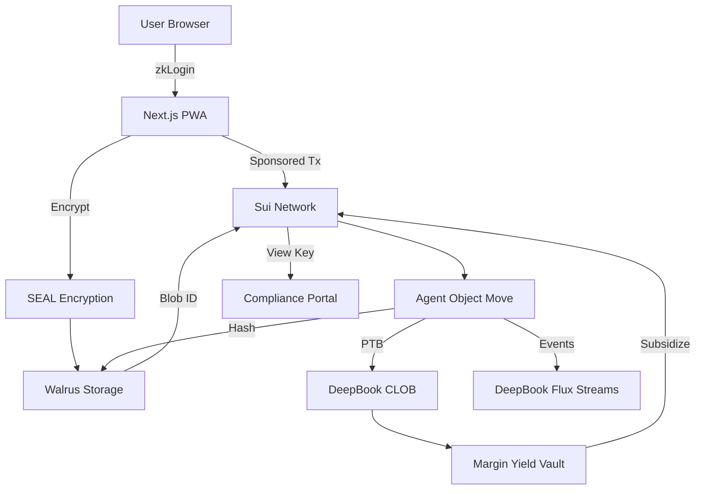
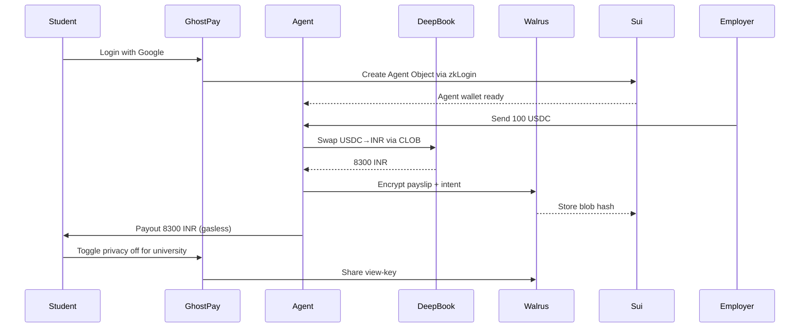

# GhostPay — The Invisible Agent Bank

> Built for Sui Overflow 2026 | Walrus Track | University Team

GhostPay is a production-grade web app where every user gets an autonomous AI agent with its own Sui wallet. The agent receives USDC, pays globally, swaps via DeepBook, and remembers everything privately on Walrus. Private by default, gasless for users, compliant by design.

Live demo: ghostpay.app | Testnet: Sui Testnet

---

## The Problem

1. **Remittances are broken.** A $100 transfer to Nigeria costs $35 in fees. Legacy rails are slow and expensive.
2. **Public ledgers kill adoption.** Users do not want bank accounts that look like Twitter. Privacy is mandatory for payments.
3. **AI agents cannot act economically.** Agents today cannot own assets, pay gas, store memory, or resolve disputes.
4. **Sui infra is underused.** Walrus launched for large verifiable data, DeepBook processes billions in volume, but few apps make them essential.
5. **Trust after outages.** Sui needs live, real-world apps that prove reliability for enterprises.

## The Solution: GhostPay

GhostPay spawns a Move object that IS your agent:

- Sign in with Google → zkLogin creates agent wallet (no seed phrase)
- Receive USDC → agent auto-converts via DeepBook → payout in local currency
- Every payslip, KYC, and agent decision encrypted on Walrus, hash anchored on Sui
- Private by default, shareable via view-key for compliance
- Gasless UX via sponsored transactions

One product solves payments, privacy, agents, storage, and liquidity.

## Uniqueness — Why No One Has Built This

- **Agent = Object:** Not a bot calling a wallet. The agent IS a Sui object with owned assets, parallel execution.
- **Memory Layer:** Walrus is not optional storage. It is the agent's encrypted brain for chargebacks and audits.
- **Private by Default:** Implements Mysten's 2026 vision today using SEAL + Walrus, with selective disclosure.
- **Zero-Fee UX:** DeepBook margin vault yields subsidize user fees. We turn liquidity into a business model.
- **Post-Quantum Ready:** Optional testnet PQ signatures for forward compliance.
- **University Native:** Built by students for campus gig payroll — real users on day one.

## Why This Fits Sui Overflow 2026

**Agentic Web:** Autonomous agents that transact, coordinate, and remember using Sui primitives.

**DeFi & Payments:** Programmable, private, zero-fee stablecoin rails for real-world remittance.

**Walrus Track:** Core innovation is Walrus as verifiable data and memory layer for agents. Without Walrus, no chargeback, no compliance.

**DeepBook Track:** Uses DeepBook CLOB as foundational liquidity — FX routing, vault yields, live spreads <1bp.

We submit to **Walrus** (least crowded, $35k 1st prize) but demonstrate all four tracks.

## Why This Wins

1. **Solves founder-stated problems:** Abiodun's $1T stablecoin volume, $35 fee example, agent chargeback need, private payments roadmap.
2. **Makes Sui infra essential:** Walrus and DeepBook are not add-ons, they are the product.
3. **Production ready:** Web app, not prototype. Live on testnet, mainnet-ready with audit credits.
4. **University advantage:** 100% student team, qualifies for $2,500 University Award (10 winners).
5. **Post-hackathon fundable:** Clear SaaS model, needs OpenZeppelin/OtterSec audit — exactly what the $250k+ package offers.
6. **Defensible moat:** Agent memory + privacy + liquidity flywheel compounds with each user.

## Architecture

Components:

Frontend: Next.js, TypeScript, Sui Wallet Kit, zkLogin
Agent Core: Move package, owned objects, PTBs
Privacy: SEAL for encryption, Walrus for blobs
Liquidity: DeepBook SDK, Flux Streams SSE
Backend: Node.js indexer, sponsored tx service

freebuff --continue 2026-06-21T05-09-55.537Z
freebuff --continue 2026-06-21T05-09-55.537Z